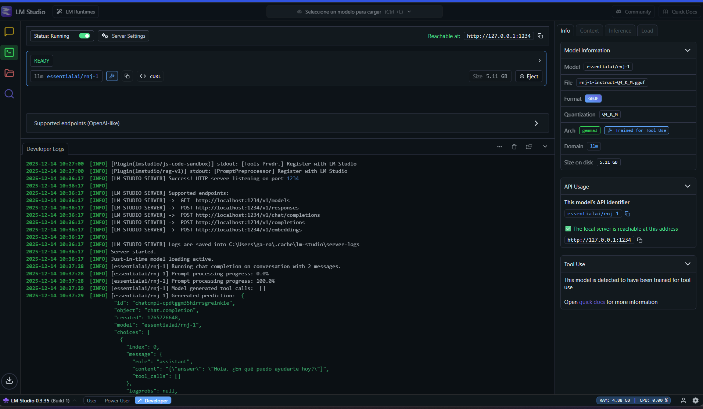
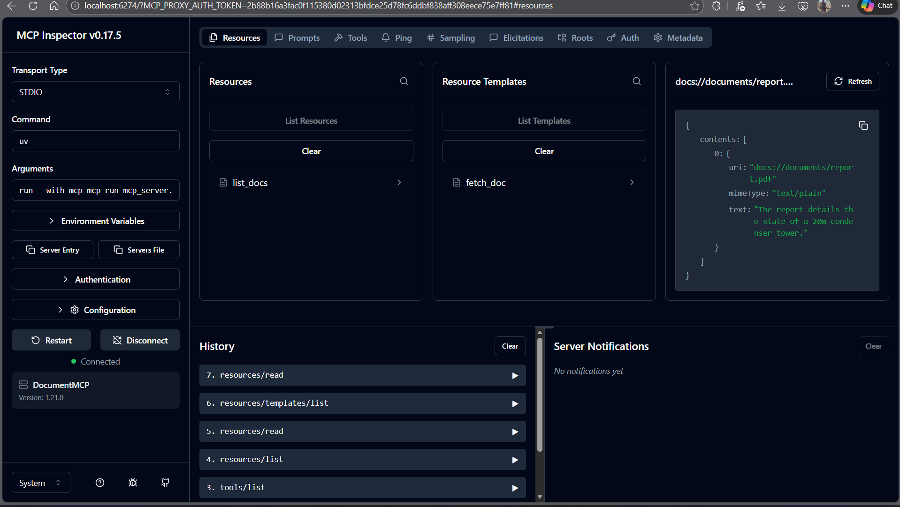
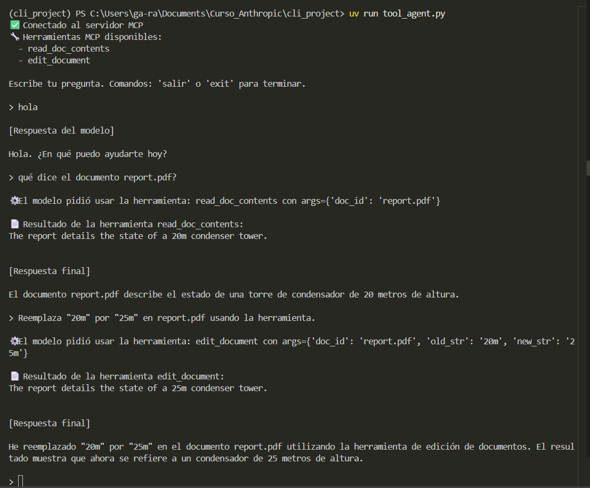
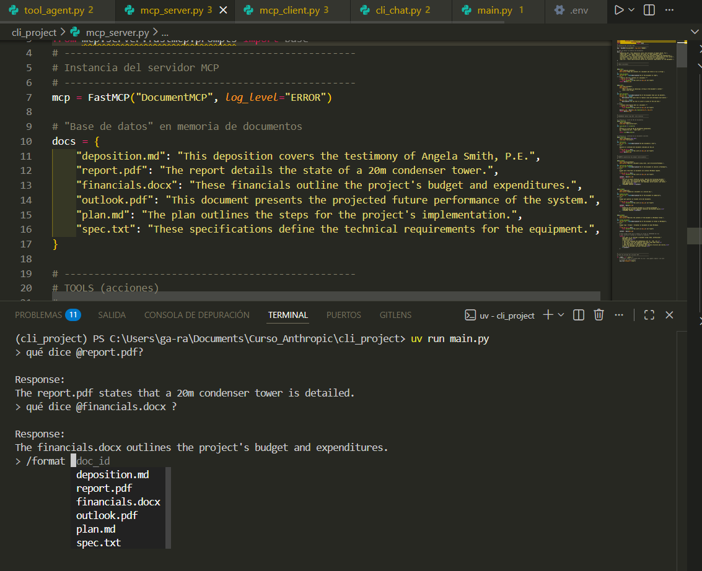

# 🤖 MCP Local LLM CLI

<div align="center">


**Cliente y servidor MCP usando modelos locales en lugar de Claude** 🚀

[Demo](#-demo-cicd) · [Arquitectura](#-arquitectura) · [Instalación](#️-instalación)

</div>

---

## 📋 Tabla de Contenidos

- [Demo](#-demo-en-video)
- [Idea General](#-idea-general)
- [Arquitectura](#-arquitectura)
- [Estructura del Proyecto](#-estructura-del-proyecto)
- [Requisitos](#-requisitos)
- [Instalación](#️-instalación)
- [Configuración del Modelo Local](#-configuración-del-modelo-local-lm-studio)
- [Probar el Servidor MCP](#-probar-el-servidor-mcp)
- [Probar Tools](#️-probar-tools-con-tool_agentpy)
- [Chat CLI](#-chat-cli-con-recursos-y-prompts)
- [Notas de Seguridad](#-notas-de-seguridad)
- [Próximos Pasos](#-próximos-pasos)

---

## 🎥 Demo en video


Demo de cliente y servidor MCP que usan un **modelo local** (LM Studio / OpenAI compatible) en lugar de Claude.

**Incluye:**

- Chat CLI
- Servidor MCP con **tools**, **resources** y **prompts**
- Integración con un modelo como `qwen/qwen3-8b` corriendo en `localhost`

---

## 🚀 Idea general

Este proyecto es una adaptación del flujo típico de MCP con Claude, pero:

- En vez de usar la API de Anthropic,
- Se usa un **modelo local** servido por LM Studio (u otro servidor OpenAI-compatible),
- Conservando toda la arquitectura de:
  - `MCPClient` (cliente MCP)
  - `mcp_server.py` (servidor MCP con tools/resources/prompts)
  - CLI interactiva con:
    - menciones de documentos (`@report.pdf`)
    - comandos basados en prompts (`/format plan.md`, `/summarize …`)

---

## 🧱 Arquitectura

### Componentes principales

#### 🖥️ Servidor MCP (`mcp_server.py`)

Diccionario en memoria `docs` con documentos de ejemplo:

- `deposition.md`
- `report.pdf`
- `financials.docx`
- `outlook.pdf`
- `plan.md`
- `spec.txt`

**Tools:**

- `read_doc_contents(doc_id)` → devuelve el contenido del documento
- `edit_document(doc_id, old_str, new_str)` → hace un find/replace simple

**Resources:**

- `docs://documents` → lista de IDs de documentos
- `docs://documents/{doc_id}` → contenido del documento

**Prompts:**

- `rewrite_markdown(doc_id)` → reescribe el doc en Markdown claro
- `summarize(doc_id)` → genera un resumen conciso
- `format(doc_id)` → formatea el documento como un informe estructurado en Markdown


#### 📡 Cliente MCP (`mcp_client.py`)

Envuelve `ClientSession` del SDK MCP.

**Expone métodos:**

- `list_tools()`
- `call_tool(tool_name, tool_input)`
- `read_resource(uri)`
- `list_prompts()`
- `get_prompt(prompt_name, args)`


#### 🤖 Integración con el modelo local (`core/claude.py`)

Clase `Claude` adaptada para llamar a:

```
http://localhost:1234/v1/chat/completions
```

Usa un modelo configurado por entorno, por ejemplo:

```
LOCAL_LLM_MODEL=qwen/qwen3-8b
```


#### 💻 Interfaces de uso

- `tool_agent.py` → pequeño agente de línea de comandos para probar **tool calling** MCP
- `main.py` + `core/cli.py` + `core/cli_chat.py` → chat CLI "bonito" con:
  - menciones `@documento`
  - comandos `/format`, `/summarize`, etc.

---

## 📂 Estructura del proyecto

```
cli_project/
├── core/
│   ├── claude.py        # Wrapper del modelo local (LM Studio / OpenAI compatible)
│   ├── cli.py           # Bucle principal de la CLI
│   ├── cli_chat.py      # Lógica de chat, menciones @ y prompts /
│   └── chat.py          # Lógica general de agente/estado de mensajes
├── mcp_server.py        # Servidor MCP: tools, resources y prompts
├── mcp_client.py        # Cliente MCP: list_tools, call_tool, read_resource, prompts
├── tool_agent.py        # Agente sencillo para probar tools MCP con el modelo local
├── main.py              # Punto de entrada del chat CLI
├── pyproject.toml       # Configuración del proyecto y dependencias (uv / Python)
├── uv.lock              # Lockfile de dependencias (opcional)
├── .env                 # Variables de entorno (NO se sube a GitHub)
├── .gitignore           # Archivos ignorados por git (.env, .venv, etc.)

```

---

## 🔧 Requisitos

- **Python 3.9+**
- **uv** (recomendado)
  - https://docs.astral.sh/uv/
- **LM Studio** (u otro servidor OpenAI-compatible) con un modelo como:
  - `qwen/qwen3-8b` o similar corriendo en `localhost:1234`

---

## ⚙️ Instalación

### 1. Clonar el repositorio

```bash
git clone https://github.com/tu-usuario/mcp-local-llm-cli.git
cd mcp-local-llm-cli
```

### 2. Crear entorno con uv (recomendado)

```bash
uv venv
.\.venv\Scripts\activate   # En Windows PowerShell

uv pip install -e .
```

> Si prefieres, puedes usar `python -m venv .venv` y `pip install -r ...`


### 3. Configurar variables de entorno

Crea un archivo `.env` (NO lo subas al repo) basado en `.env.example`:

```env
LOCAL_LLM_MODEL="qwen/qwen3-8b"
LOCAL_LLM_BASE_URL="http://localhost:1234/v1"
LOCAL_LLM_API_KEY="not-needed"
```

---

## 🤖 Configuración del modelo local (LM Studio)

1. **Abre LM Studio**

2. **Descarga/carga el modelo**, por ejemplo: `Qwen/Qwen3-8B`

3. **Inicia el servidor OpenAI-compatible:**
   - Puerto: `1234`
   - Endpoint típico: `http://localhost:1234/v1/chat/completions`

4. **Opcional:** prueba con `curl` o una petición mínima para confirmar que responde



---

## 🧪 Probar el servidor MCP

### 1. Abrir MCP Inspector

```bash
uv run mcp dev mcp_server.py
```

Abre la URL que te indique (ej. `http://127.0.0.1:6274`).

**Verifica:**

- **Tools:** `read_doc_contents`, `edit_document`
- **Resources:** `docs://documents`, `docs://documents/{doc_id}`
- **Prompts:** `rewrite_markdown`, `summarize`, `format`



---

## 🛠️ Probar tools con `tool_agent.py`

```bash
uv run tool_agent.py
```

### Ejemplos de interacción:

```
> hola
> qué dice el documento report.pdf?
> Reemplaza "20m" por "25m" en report.pdf usando la herramienta.
```

**Verás cómo el modelo:**

1. Responde en lenguaje natural
2. Pide usar la tool `read_doc_contents` o `edit_document`
3. El agente ejecuta la tool en el servidor MCP
4. Devuelve la respuesta final combinando tool + modelo



---

## 💬 Chat CLI con recursos y prompts

```bash
uv run main.py
```

### Ejemplos de interacción

#### 📄 Menciones de documentos con resources

```
> qué dice @report.pdf?
```

El cliente:

1. usa `docs://documents/report.pdf` en el servidor MCP
2. inyecta el contenido en el contexto
3. y el modelo responde explicando el documento


#### 📝 Formateo con prompts (`/format`)

```
> /format plan.md
```

Utiliza el prompt MCP `format` para producir una versión en Markdown estructurado del documento `plan.md`.



#### 🔍 Otros prompts (si los defines)

```
> /summarize report.pdf
> /rewrite_markdown deposition.md
```

---

## 🔐 Notas de seguridad

- ⚠️ **NO subas `.env`** ni ninguna clave real de API
- 🔒 Si alguna vez se subió `.env`, revoca las claves y elimina el archivo del historial
- 🛡️ Mantén tu modelo local detrás de `localhost` o una red segura si lo expones

### .gitignore recomendado

```gitignore
# Entorno virtual
.venv/
venv/

# Variables de entorno
.env

# Python
__pycache__/
*.pyc
*.pyo

# Lockfiles
uv.lock
poetry.lock

# IDE
.vscode/
.idea/
```

---

## 🧩 Próximos pasos

### 1️⃣ Reemplazar documentos de ejemplo

Cambiar los documentos del diccionario `docs` por:

- ✅ Notas reales de clase
- ✅ Fragmentos de informes de seguridad
- ✅ Extractos de expedientes o casos (sin datos sensibles)

### 2️⃣ Crear nuevos prompts especializados

```python
# Ejemplos de prompts personalizados
/reporte_seguridad
/resumen_legal
/formato_presentación
```

### 3️⃣ Integrar más herramientas

- 📊 Análisis de datos
- 🔍 Búsqueda en bases de conocimiento
- 📧 Generación de correos formales

### 4️⃣ Añadir persistencia

- 💾 Base de datos para documentos
- 📝 Historial de conversaciones
- 🔄 Sincronización con servicios externos

De esta forma, tu MCP se convierte en una **capa de herramientas y plantillas** sobre tu propio modelo local, lista para adaptarse a **ciberseguridad, derecho o cualquier otro dominio**.

---

## 🤝 Contribuir

¿Mejoras o sugerencias? ¡Pull requests bienvenidos!

1. Fork el proyecto
2. Crea tu rama: `git checkout -b feature/nueva-funcionalidad`
3. Commit: `git commit -m 'Añade nueva funcionalidad'`
4. Push: `git push origin feature/nueva-funcionalidad`
5. Abre un Pull Request

---

## 📄 Licencia

Este proyecto es libre de usar para propósitos educativos y de laboratorio.

---

## 🙏 Agradecimientos

- [Model Context Protocol (MCP)](https://modelcontextprotocol.io/)
- [LM Studio](https://lmstudio.ai/)
- [Anthropic MCP SDK](https://github.com/anthropics/anthropic-sdk-python)
- [OpenAI API Specification](https://platform.openai.com/docs/api-reference)

---

<div align="center">

**⭐ MCP + Modelos Locales: control total sobre tu IA! ⭐**

Hecho con ❤️ para desarrolladores que valoran la privacidad y el control local

</div>
